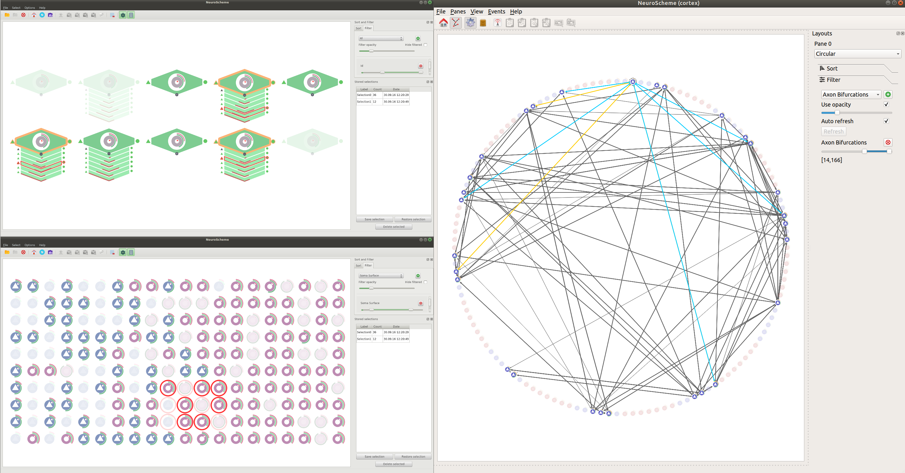

# NeuroScheme



## Introduction

NeuroScheme is a tool for navigating, exploring, creating and interacting with
NeuroScience data using abstract, schematic or expressive representations.

## Dependencies

* Required dependencies:
    * ShiFT (requires FiReS and Boost) (1)
    * scoop (1)
    * Qt5
    * Eigen3

* Optional dependencies:
    * nsol: needed to load data via nsol. In order to load BlueConfig files nsol
      has to be built with Brion support. (2)
    * ZeroEQ & Lexis: enables syncing selections, syncing camera position and
      sending binary cell set operations (2)
    * (TODO) gmrvlex: enables sending focus messages
    * (TODO) Deflect: enables streaming the main window of the app

* (1) Automatically downloaded and build
* (2) Automatically downloaded and build uncommenting .gitsubprojects entry

In order to check which optional dependencies have been used the following
command can be used:

```bash
./NeuroScheme --version
```

## Download binary packages

There are binaries for x64 architecture for GNU/Linux, MS Windows and MacOSX
available for download in
[http://gmrv.es/gmrvvis/apps/NeuroScheme/](http://gmrv.es/gmrvvis/apps/NeuroScheme/)

## Building from source

NeuroScheme has been successfully built and used on Ubuntu 16.04/18.04, Mac OSX
Yosemite/Sierra and Windows 7/8/10 Visual Studio 2015 Win64. The following steps should be
enough to build it just with the required dependencies.

```bash
git clone --recursive https://github.com/gmrvvis/NeuroScheme
mkdir NeuroScheme/build && cd NeuroScheme/build
cmake .. -DCLONE_SUBPROJECTS=ON -DCMAKE_BUILD_TYPE=Release
make
```

## Updating

If you have already built NeuroScheme and want to update to the latest available
version, after pulling the repository and before building, you will have to
update the automatically downloaded dependencies. This can be done just running
```make rebase```

```bash
cd neuroscheme_source_dir
git pull
cd build
make rebase
make
```

## Running

At the moment NeuroScheme running options have to be defined via command line
interface. To take a look to the arguments NeuroScheme accepts you can run the
following:

```bash
./bin/NeuroScheme --help
```

NeuroScheme accepts different domains (for example, cortex and congen domains)
which can be selected when GUI is started or via the "-d" parameter. Each domain
can have its own specific parameters, which can be displayed with ```--help```
argument.

### Loading and exporting data

#### All domains

All domains can import from and export to a custom JSON format, accessible via a
menu or using CLI arguments (only for importing).

```bash
./bin/NeuroScheme -d domain --json /path/to/file.json
```

#### Cortex domain

Loading data in cortex domain can be done from both nsol's XML scene and
BlueBrain's BlueConfig files. If you have built NeuroScheme with nsol support
(explained in the [Dependencies](#dependencies) section) you can
try to visualize a very simple scene by running:

```bash
./bin/NeuroScheme -d cortex -xml nsol/testData/scene.xml
```

#### Congen domain


For congen domain you can try to visualize a very simple example scene by
running.

```bash
./bin/NeuroScheme -d cortex -xml ../doc/examples/congen-example.json
```

Congen domain also allows importing and exporting data to NeuroML. Please note
that exporting to NeuroML removes the hierarchy. In case you want to keep the
created hierarchy please export it to JSON as explained previously.

Importing and exporting to NeuroML operations are available through the GUI menu
and also importing is available through CLI arguments.

```bash
./bin/NeuroScheme -d congen -x /path/to/neuroML.xml
```

### Interacting with data

Once a dataset has been loaded you can navigate through the hierarchy or
visualize the grouped items right-clicking in the representation and selecting
the proper option (if available in the specific dataset). The new visualization
can be shown in the same panel or in a new one (horizontal or vertical pane
splitting can be selected under "Panes" menu).

When clicking in the toolbar "gear" icon a side panel is shown containing the
options regarding layouts, filtering and sorting capabilities.

Clicking in the toolbar "drawer" icon a side panel is shown containing the
options regarding stored selections.

**Note:** The "free movement layout" and the "multi-panel" are still in early
development and may cause some bugs.

#### Key modifiers

* Moving items. By holding ```shift``` key while clicking over an item and moving
  the mouse, NeuroScheme automatically changes the layout to "free movement
  layout".

* Inspecting items. By holding ```ctrl``` key while passing the mouse over an
  item, the inspector is opened (or updated in case it was already opened)
  showing the attributes of the item and also allowing to edit and save them.


### Creating data

The creating feature is still in a development stage. If you want to try it
out you can start with a clear canvas or load a dataset as specified before. To
create entities you can click on the background of the canvas, select the type
of entity and define its properties in the side panel. To edit or duplicate an
entity right click on its representation and select the apropriated option. You
can also define connection relationships between entities using drag and
drop. To visualize connections you have to enable the option in the toolbar or
under the menu "Scene".
